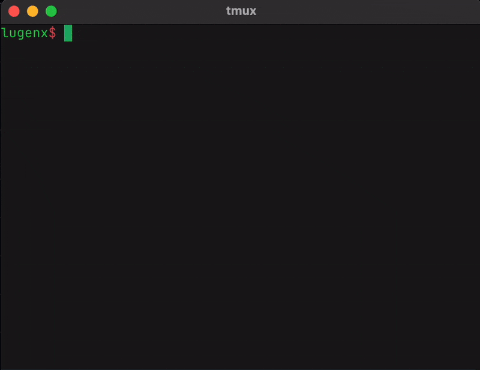

# Lab
**Lab** lets you experiment with code instantly—just type `lab js` (or any extension) and your editor opens, ready to go. No more overhead of creating files and folders. Your experiments are automatically organized with smart names (e.g., `250112a.js`) in a `lab` folder, and they clean themselves up after 7 days to keep things tidy.

## Install
### macOS (Intel)
```bash
curl -L https://github.com/lugenx/lab/releases/latest/download/lab-darwin-amd64 -o /tmp/lab && chmod +x /tmp/lab && sudo mv /tmp/lab /usr/local/bin/lab
```
### macOS (Apple Silicon)
```bash
curl -L https://github.com/lugenx/lab/releases/latest/download/lab-darwin-arm64 -o /tmp/lab && chmod +x /tmp/lab && sudo mv /tmp/lab /usr/local/bin/lab

```
### Linux
```bash
curl -L https://github.com/lugenx/lab/releases/latest/download/lab-linux-amd64 -o /tmp/lab && chmod +x /tmp/lab && sudo mv /tmp/lab /usr/local/bin/lab
```
### Windows
```powershell
# Create directory in AppData
mkdir "$env:LOCALAPPDATA\Lab"

# Download executable
curl -L -o "$env:LOCALAPPDATA\Lab\lab.exe" https://github.com/lugenx/lab/releases/latest/download/lab-windows-amd64.exe

# Add to PATH (might need to restart terminal)
[Environment]::SetEnvironmentVariable("Path", $env:Path + ";$env:LOCALAPPDATA\Lab", "User")
```
## Usage
Open a new file:
```bash
# Open a fresh file with an extension
lab <extension> 

# Examples:
lab js      # Opens a new JavaScript file
lab py      # Opens a new Python file
lab any     # Opens a new file with any extension
```

List your files:
```bash
# List files in your lab folder
lab

# Example output:
Lab Files: ~/lab/

[1]  250112c.js     6d    # Will be deleted in 6 days
[2]  250112b.py     12h   # Will be deleted in 12 hours
[3]  250112a.go     45m   # Will be deleted in 45 minutes
```

Open recent files:
```bash
# Open a recent file by number
lab <number>

# Examples:
lab 0                  # Open the config file
lab 1                  # Open the most recent file
lab 2                  # Open the second file
```
Manage files:
```bash
# Delete files
lab -d <number>
lab --delete <number>

# Get file path
lab -p <number>
lab --path <number>

# Run any command on the file
lab -r <number> <command>
lab --run <number> <command>

# Run the file if its compiled executable
lab -r, --run <number>

# Example:
lab -d 2               # delete file #2
lab -p 1               # show file path
lab -r 1               # run file #1 if it is executable binary
lab -r 1 node          # run file with Node.js
lab -r 2 vim           # open file in different editor
lab -r 3 cat           # view file contents

```
Other commands:
```bash
lab -v, --version      # show version
lab -h, --help         # show help
```

## Features
- **Instant Start**: `lab <extension>` opens a fresh file.
- **Quick Access**: `lab <number>` reopens recent files.
- **Auto-Cleanup**: Files expire automatically after 7 days (configurable).
- **Smart Time Display**: Shows remaining time in days/hours/minutes with color indicators
- **Simple Listing**: Just run lab to see your files, newest first
- **File Management**: Delete, run, or use files with other tools

## Configuration
Lab creates a config file at `~/lab/.lab`:
```
editor=nvim          # your preferred editor
lifedays=7          # how long to keep files
prefix=lab          # file prefix
```
You can also set the `LABPATH` environment variable to change the parent directory of the lab from the default home directory (`~/lab`).

Focus on experimenting and trying out ideas without distractions—Lab simplifies the process so you can start coding immediately.

 ## Demo
 See Lab in action:
 
